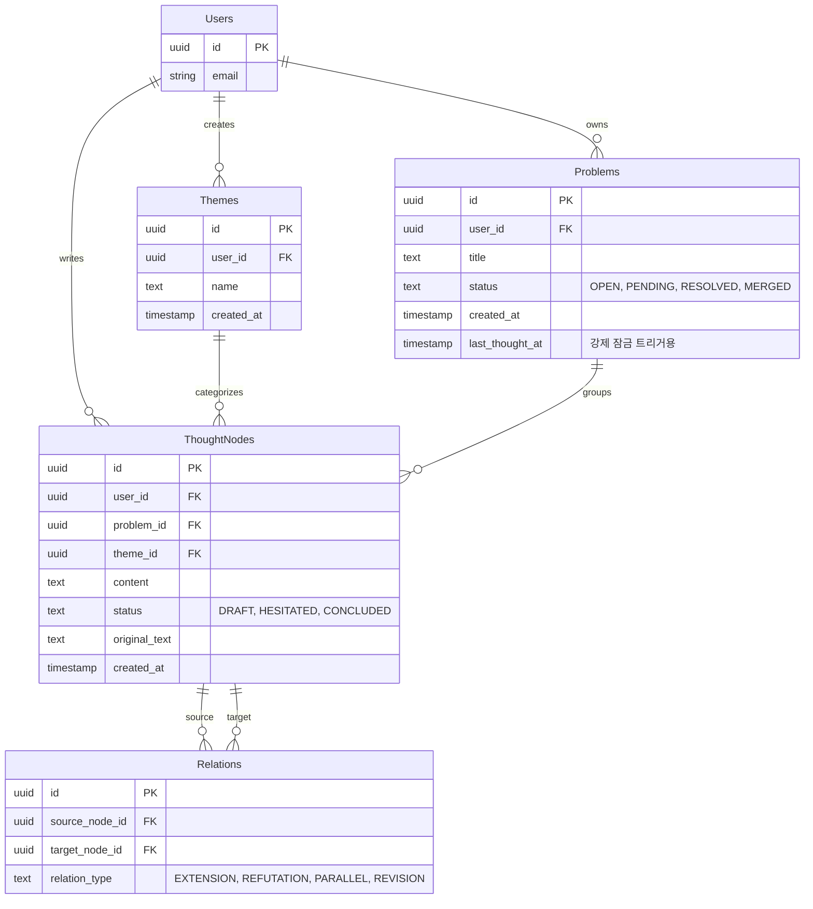

# 🏗️ 사유 시스템 상세 인프라 및 아키텍처 설계서 (INFRA_PLAN.md)

이 문서는 사유 시스템(Thought Mapping System) 구축을 위한 **최종적이고 가장 구체적인 구현 설계도**입니다. 코드를 배포하기 직전 단계의 탐색과 구조화가 완료된 상태이며, AI 에이전트는 이 문서의 스펙을 그대로 코드로 옮기는 작업을 수행해야 합니다.

---

## 1. 시스템 아키텍처 시각화 (System Architecture)

전체 시스템은 Next.js(App Router)를 중심 뼈대로 하며, 상태 관리, AI 분석 파이프라인, 프라이빗 클라우드(DB/Auth)가 결합된 형태입니다.

```mermaid
graph TD
    subgraph Client [Frontend - Next.js Client Components]
        UI[UI Components (shadcn/ui)]
        Canvas[The Canvas (에디터)]
        Timeline[The Timeline (사유 궤적)]
        Graph[The Graph (관계망)]
        Lock[Reflection Lock (강제 회고 잠금 UI)]
        Store[Zustand State Manager]
        
        UI --> Canvas & Timeline & Graph
        Canvas & Timeline --> Lock
        Store <--> Canvas & Timeline & Lock
    end

    subgraph Server [Backend - Next.js Server & APIs]
        Actions[Server Actions (Data Mutation)]
        RouteAI[API Route: /api/ai/analyze]
    end

    subgraph External [External Services]
        Supa[(Supabase: Auth & PostgreSQL)]
        LLM[OpenAI API (GPT-4o)]
    end

    Client -->|CRUD 요청 (SSR/CSR)| Actions
    Client -->|사유 분석 요청| RouteAI
    Actions <-->|RLS 기반 쿼리| Supa
    RouteAI <-->|프롬프트 & 컨텍스트 전송| LLM
```

---

## 2. 디렉토리 구조 설계 (Directory Structure)

`src` 폴더 기반의 Next.js App Router 구조입니다. 도메인(기능) 단위로 폴더를 응집하여 관리합니다.

```text
src/
├── app/
│   ├── (auth)/             # 로그인/가입 등 인증 관련 페이지 그룹
│   ├── (dashboard)/        # 실제 사유 시스템 메인 페이지 그룹
│   │   ├── page.tsx        # 메인 대시보드 (캔버스 + 현재 뷰)
│   │   ├── layout.tsx      # 사이드바 (맥락적 넛지, 주제 리스트) 및 잠금 오버레이
│   │   └── problem/[id]/   # 특정 문제(Problem)에 대한 깊은 타임라인 뷰
│   ├── api/
│   │   └── ai/analyze/route.ts # AI 텍스트 분석 API 엔드포인트
│   ├── globals.css         # Tailwind 글로벌 스타일
│   └── layout.tsx          # Root Layout (폰트, 테마 프로바이더)
├── components/
│   ├── ui/                 # shadcn/ui 기본 컴포넌트들 (버튼, 다이얼로그 등)
│   ├── canvas/             # The Canvas 관련 컴포넌트 (Editor.tsx, AISuggestion.tsx)
│   ├── views/              # Timeline, Graph 뷰 컴포넌트
│   └── shared/             # ReflectionLockOverlay.tsx, ContextualNudge.tsx
├── lib/
│   ├── supabase/           # Supabase 클라이언트 및 서버 유틸 (ssr.ts)
│   ├── ai/                 # OpenAI 프롬프트 및 파싱 유틸 (prompts.ts)
│   └── utils.ts            # Tailwind 머지(cn) 등 공통 유틸리티
├── store/                  # Zustand 상태 관리 스토어
│   ├── useCanvasStore.ts   # 현재 작성중인 글 상태 및 AI 제안 데이터
│   └── useSystemStore.ts   # 강제 회고 잠금 여부 등 시스템 전역 상태
└── types/
    └── supabase.ts         # Supabase DB 타입 (Supabase CLI로 자동 생성)
```

---

## 3. 데이터베이스 스키마 및 RLS 전략 (Database Schema)

Supabase PostgreSQL 기반의 ERD 시각화 및 주요 구조입니다. 모든 테이블은 `Row Level Security (RLS)`가 활성화되어 `auth.uid() = user_id` 인 경우만 접근 가능한 프라이빗 DB로 작동합니다.



---

## 4. 핵심 로직 & 상태 관리 파이프라인 (Core Data Flow)

### 4.1. AI 텍스트 분석 파이프라인 (The Canvas Flow)
1. **사용자 액션**: 메인 캔버스 창에 생각("사고")을 입력 후 Enter 또는 일정 시간 디바운스.
2. **상태 관리**: `useCanvasStore`에 텍스트 임시 저장됨.
3. **API 호출**: `POST /api/ai/analyze` 호출. (이때, 사용자의 기존 Themes, 최근 활성 Problems 리스트도 함께 컨텍스트로 전달).
4. **AI 프롬프트 동작**: 
   - 텍스트 요약
   - 가장 가까운 `problem_id` 매핑 (또는 신규 문제 생성 제안)
   - 가장 가까운 `theme_id` 매핑 제안
   - `status` (유보/단정) 추론
5. **UI 렌더링**: Canvas 주변에 "희미한 텍스트" 또는 "작은 칩(Chip)" 형태로 제안 노출 -> 사용자가 `Tab` 또는 클릭으로 수락.
6. **서버 등록**: 수락 시 Server Action (e.g., `createThoughtNode`) 실행 -> DB 반영 -> View 자동 리렌더 (Next.js 캐시 무효화).

### 4.2. 강제 회고 잠금 로직 (Reflection Lock Pipeline)
방치된 생각(보류/열림 상태)을 강제로 이어가게 만드는 필수 모듈입니다.
1. **서버 평가**: 유저 접속 시, `<DashboardLayout>`의 Server Component가 `Problems` 테이블을 조회합니다.
2. **트리거 조건**: `status`가 'OPEN' 또는 'PENDING'이면서, **`last_thought_at`이 `현재 시점 - N일` (예: 3일) 보다 과거인 문제**가 존재하는지 필터링.
3. **강제 오버레이 렌더링**: 
   - 트리거 작동 시, 클라이언트로 `isLocked = true`와 `targetProblem` 정보가 전달됩니다.
   - `ReflectionLockOverlay.tsx`가 화면 전체 또는 입력 폼(The Canvas) 위를 덮습니다.
   - 메인 화면에는 오직 **"밀려 있는 질문: [타이틀]"** 과 해당 질문의 최근 사고 노드들만 보여줍니다.
   - 사용자가 **이 문제에 대해 코멘트나 상태 업데이트를 제출해야만** 서버에서 `last_thought_at`이 갱신되며 데스트바운스가 해제(Unlock)됩니다.

---

## 5. 실행을 위한 코드 작성 페이즈 (Implementation Plan)

AI 에이전트(저)는 다음 순서에 따라 코드를 작성합니다.

- **[Phase 1] 기초 공사 및 터미널 셋업**
  - Next.js 설치, shadcn/ui 초기화, Tailwind 셋업 (`run_command` 도구 사용)
  - 폴더 구조(`src/app`, `src/components` 등) 라우터 뼈대 생성
- **[Phase 2] DB 및 인증 연동**
  - Supabase 환경변수 등록 및 클라이언트 생성 (`lib/supabase/ssr.ts`)
  - Typescript 타입 변환(`types/supabase.ts`)
- **[Phase 3] 코어 UI 컴포넌트**
  - 메인 레이아웃 및 캔버스 입력부(`Editor.tsx`) 구축 
  - Zustand 스토어(`useCanvasStore`, `useSystemStore`) 구성
- **[Phase 4] AI API 및 비즈니스 로직**
  - OpenAI 라우터 작성 및 `prompts.ts` 구현 (주제가 무분별하게 생기지 않도록 하는 `AI_HANDOFF.md`의 규칙 주입)
  - `ReflectionLockOverlay` 강제 모듈 코드 구현
- **[Phase 5] 데이터 시각화 보강뷰 (Timeline & Graph)**
  - 문제 기반 타임라인 정렬 뷰 컴포넌트 작성
  - 관계망 시각화(의존성 리스트업) 구현

이 문서는 단순한 아이디어를 넘어, 함수, 테이블명, 상태 변수명까지 정의한 **구체적 지시서**입니다. 다음 명령에서 Phase 1부터 코드 작성을 진입하게 됩니다.
